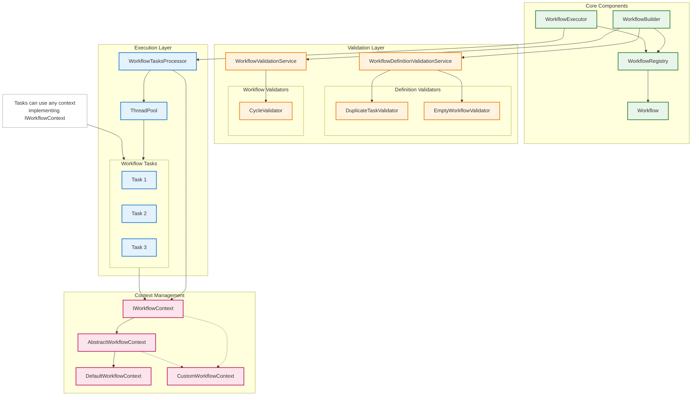
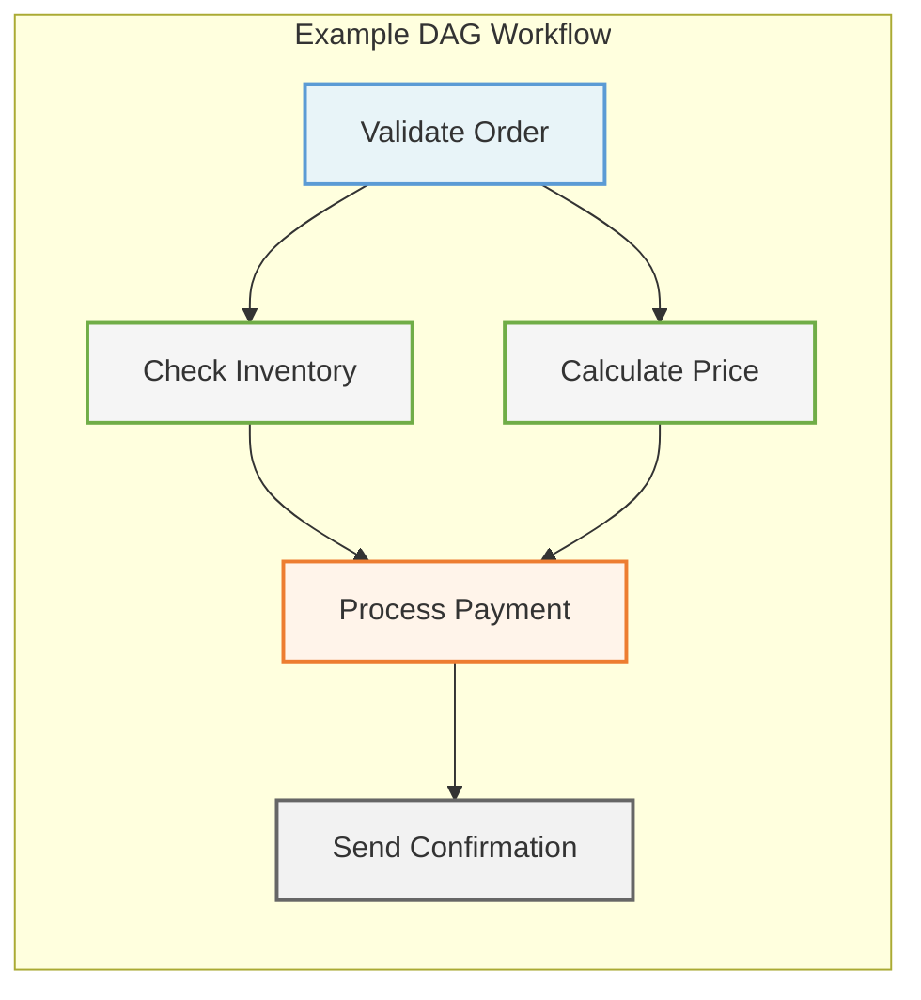
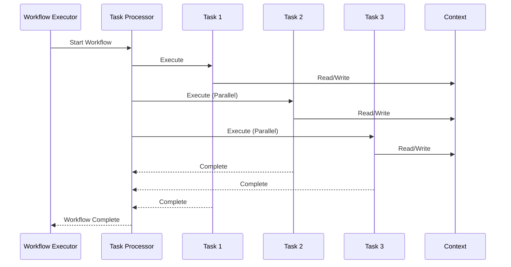

# Pyenoma Workflow Library

A sophisticated Spring-based workflow execution framework that enables building and running complex task workflows with
parallel execution capabilities, comprehensive error handling, and robust validation. The library implements a directed
acyclic graph (DAG) execution model, making it perfect for complex business processes, data pipelines, and multi-step
operations that require precise control over task dependencies.

## Overview

The Pyenoma Workflow Library provides a declarative way to define and execute task-based workflows in Spring
applications. It stands out by offering:

- Annotation-driven workflow definitions for clean, maintainable code
- Parallel task execution with sophisticated dependency management
- Thread-safe context sharing between tasks
- Comprehensive error handling with customizable error handlers
- Automatic workflow validation including cycle detection
- Spring Boot auto-configuration for seamless integration
- Execution tracking and monitoring capabilities

## System Architecture



## Table of Contents

1. [Getting Started](#getting-started)
2. [Core Concepts](#core-concepts)
3. [Configuration](#configuration)
4. [Creating Workflows](#creating-workflows)
5. [Advanced Features](#advanced-features)
6. [Error Handling](#error-handling)
7. [Best Practices](#best-practices)
8. [API Reference](#api-reference)

## Getting Started

### Prerequisites

- Java 17 or higher
- Spring Boot 3.x
- Lombok

### Installation

Add the dependency to your `pom.xml`:

```xml

<dependency>
   <groupId>org.pyenoma</groupId>
   <artifactId>workflow-library</artifactId>
   <version>{latest-version}</version>
</dependency>
```

### Quick Start Example

Here's a minimal example to get you started:

```java
// 1. Define a task
@WorkflowTaskBean
public class WelcomeEmailTask implements IWorkflowTask<DefaultWorkflowContext> {
   @Override
   public WorkflowNodeResult execute() throws WorkflowException {
      // Implementation
      return WorkflowNodeResult.SUCCESS;
   }
}

// 2. Define your workflow
@WorkflowDefinition(id = "userOnboarding", tasks = {
        @WorkflowTask(taskClass = WelcomeEmailTask.class, next = {CreateUserProfileTask.class}),
        @WorkflowTask(taskClass = CreateUserProfileTask.class, next = {InitializeSettingsTask.class}),
        @WorkflowTask(taskClass = InitializeSettingsTask.class)})
public class UserOnboardingWorkflow {
}

// 3. Execute the workflow
@Service
public class OnboardingService {
   @Autowired private WorkflowExecutor workflowExecutor;

   public void onboardUser() throws WorkflowException, InterruptedException {
      IWorkflowContext context = workflowExecutor.execute("userOnboarding",
              () -> new DefaultWorkflowContext("userOnboarding"));
   }
}
```

## Core Concepts

### Workflow Structure

A workflow in this library is represented as a Directed Acyclic Graph (DAG) where:

- Nodes represent individual tasks (`IWorkflowTask` implementations)
- Edges represent dependencies between tasks
- The execution order is determined by task dependencies
- Multiple tasks can execute in parallel when their dependencies are satisfied

### Workflow Execution Model





### Tasks

Tasks are the fundamental units of work in the workflow system. Each task:

- Implements the `IWorkflowTask` interface
- Is annotated with `@WorkflowTaskBean`
- Has access to a shared context
- Returns a `WorkflowNodeResult` indicating success or failure
- Can specify error handlers

Example of a custom task:

```java

@WorkflowTaskBean(errorHandler = CustomErrorHandler.class)
public class DataProcessingTask implements IWorkflowTask<DefaultWorkflowContext> {
   @Autowired private DataService dataService;

   @Override
   public WorkflowNodeResult execute() throws WorkflowException {
      try {
         String data = getContext().get("inputData", String.class);
         String processed = dataService.process(data);
         getContext().put("processedData", processed);
         return WorkflowNodeResult.SUCCESS;
      } catch (Exception e) {
         throw new WorkflowException(getContext().getWorkflowId(), "Data processing failed", e);
      }
   }
}
```

### Context Management

The workflow context provides a thread-safe way to share data between tasks. The library offers:

- `IWorkflowContext`: Base interface for all contexts
- `AbstractWorkflowContext`: Base implementation with common functionality
- `DefaultWorkflowContext`: Ready-to-use implementation with key-value storage

Creating a custom context:

```java
public class OrderProcessingContext extends AbstractWorkflowContext {
   private final Map<String, Order> orders = new ConcurrentHashMap<>();

   public OrderProcessingContext(String workflowId) {
      super(workflowId);
   }

   public void addOrder(String orderId, Order order) {
      orders.put(orderId, order);
   }

   public Order getOrder(String orderId) {
      return orders.get(orderId);
   }
}
```

## Configuration

### Auto-Configuration

The library provides auto-configuration through `WorkflowAutoConfiguration`:

```properties
# application.properties
workflow.poll.timeout=500
```

### Custom Thread Pool Configuration

```java

@Configuration
public class WorkflowConfig {
   @Bean
   public Executor taskExecutor() {
      ThreadPoolTaskExecutor executor = new ThreadPoolTaskExecutor();
      executor.setCorePoolSize(10);
      executor.setMaxPoolSize(20);
      executor.setQueueCapacity(100);
      executor.setThreadNamePrefix("workflow-");
      return executor;
   }
}
```

## Creating Workflows

### Workflow Definition

Workflows are defined using annotations that specify the task structure and dependencies:

```java

@WorkflowDefinition(id = "orderProcessing", tasks = {
        @WorkflowTask(taskClass = ValidateOrderTask.class, next = {CheckInventoryTask.class, CalculatePriceTask.class}),
        @WorkflowTask(taskClass = CheckInventoryTask.class, next = ProcessPaymentTask.class),
        @WorkflowTask(taskClass = CalculatePriceTask.class, next = ProcessPaymentTask.class),
        @WorkflowTask(taskClass = ProcessPaymentTask.class, next = SendConfirmationTask.class),
        @WorkflowTask(taskClass = SendConfirmationTask.class)})
public class OrderProcessingWorkflow {
}
```

### Task Implementation

Tasks should be focused and follow the single responsibility principle:

```java

@WorkflowTaskBean
@RequiredArgsConstructor
public class ValidateOrderTask implements IWorkflowTask<OrderProcessingContext> {
   private final OrderValidator validator;

   @Override
   public WorkflowNodeResult execute() throws WorkflowException {
      Order order = getContext().getOrder("currentOrder");
      ValidationResult result = validator.validate(order);

      if (result.isValid()) {
         getContext().put("validationResult", result);
         return WorkflowNodeResult.SUCCESS;
      } else {
         throw new WorkflowException(getContext().getWorkflowId(), "Order validation failed: " + result.getErrors());
      }
   }
}
```

## Advanced Features

### Custom Error Handlers

Create specialized error handlers for specific tasks:

```java

@Component
public class OrderValidationErrorHandler implements IWorkflowErrorHandler {
   @Override
   public void handle(WorkflowException e, IWorkflowContext context, Class<? extends IWorkflowTask<?>> taskClass) {
      OrderProcessingContext ctx = (OrderProcessingContext) context;
      ctx.addExecution(taskClass, WorkflowNodeResult.FAILURE);
      ctx.put("validationError", e.getMessage());
      // Additional error handling logic
   }
}
```

### Workflow Validation

The library performs several validations:

1. Cycle Detection: Ensures the workflow is truly acyclic
2. Duplicate Task Detection: Prevents multiple instances of the same task
3. Workflow ID Uniqueness: Ensures unique workflow identifiers

### Dynamic Workflow Modification

While workflows are typically defined statically, you can create them programmatically:

```java
public Workflow<DefaultWorkflowContext> createDynamicWorkflow(
        List<Class<? extends IWorkflowTask<DefaultWorkflowContext>>> taskClasses) {

   Map<Class<? extends IWorkflowTask<DefaultWorkflowContext>>, Set<Class<? extends IWorkflowTask<DefaultWorkflowContext>>>> adjacency = new HashMap<>();

   // Build adjacency map
   for (int i = 0; i < taskClasses.size() - 1; i++) {
      adjacency.put(taskClasses.get(i), Set.of(taskClasses.get(i + 1)));
   }

   return Workflow.<DefaultWorkflowContext>builder().id("dynamicWorkflow").adjacency(adjacency).build();
}
```

## Error Handling

The library provides a comprehensive error handling system:

1. Task-Level Error Handling:
   - Custom error handlers per task
   - Automatic workflow termination on failures
   - Error context preservation

2. Workflow-Level Validation:
   - Structural validation
   - Dependency validation
   - Configuration validation

3. Runtime Error Management:
   - Thread interruption handling
   - Resource cleanup
   - Error propagation

### Error Handling Flow

```mermaid
stateDiagram-v2
   [*] --> TaskExecution
   TaskExecution --> Success: No Errors
   TaskExecution --> ErrorOccurred: Exception Thrown
   ErrorOccurred --> TaskErrorHandler: Task Has Handler
   ErrorOccurred --> GlobalErrorHandler: No Task Handler
   TaskErrorHandler --> RetryTask: Can Retry
   TaskErrorHandler --> FailWorkflow: Cannot Recover
   GlobalErrorHandler --> RetryTask: Can Retry
   GlobalErrorHandler --> FailWorkflow: Cannot Recover
   RetryTask --> TaskExecution
   Success --> [*]
   FailWorkflow --> [*]
 ```

## Best Practices

### Task Design

1. Keep tasks atomic and focused
2. Use appropriate error handlers
3. Implement proper cleanup in error cases
4. Design for parallel execution
5. Use meaningful task names
6. Document task dependencies

### Context Management

1. Use thread-safe collections
2. Minimize shared state
3. Document context requirements
4. Implement proper cleanup
5. Use type-safe context access
6. Consider context inheritance

### Error Handling

1. Implement custom error handlers for specific needs
2. Log appropriate error information
3. Clean up resources in error cases
4. Use appropriate error types
5. Provide meaningful error messages
6. Consider recovery strategies

### Performance

1. Configure appropriate thread pool sizes
2. Monitor task execution times
3. Use appropriate timeout values
4. Implement proper resource management
5. Consider task granularity
6. Profile workflow execution

## API Reference

### Core Interfaces

- `IWorkflowTask<T>`: Base interface for all workflow tasks
- `IWorkflowContext`: Interface for workflow context
- `IWorkflowErrorHandler`: Interface for error handlers

### Key Classes

- `WorkflowExecutor`: Main entry point for workflow execution
- `WorkflowTasksProcessor`: Handles task execution and dependencies
- `WorkflowBuilder`: Constructs workflows from definitions
- `DefaultWorkflowContext`: Standard context implementation

### Annotations

- `@WorkflowDefinition`: Defines a workflow
- `@WorkflowTask`: Defines a task and its dependencies
- `@WorkflowTaskBean`: Marks a class as a workflow task

## Contributing

We welcome contributions! Please see our [Contributing Guidelines](CONTRIBUTING.md) for details.

## License

This project is licensed under the MIT License - see the [LICENSE](LICENSE) file for details.

## Support

For support:

1. Check the documentation
2. Open an issue in the GitHub repository
3. Contact the maintainers

---

## Additional Resources

- [API Documentation](docs/api.md)
- [Example Projects](examples/)
- [Change Log](CHANGELOG.md)
- [FAQ](docs/faq.md)
